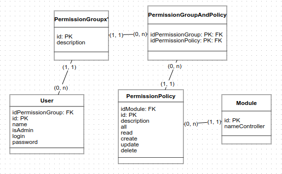

## Descrição

Um projeto simples de autenticação e controle de acesso construído em Nest.js.



## Documentação

```
http://localhost:3000/doc
```

## Configuração
```bash
nest -v
9.4.2

node -v
v16.15.0
```

## Instalação

```bash
$ npm install
```

## Executar

```bash
# development
$ npm run start

# watch mode
$ npm run start:dev

# production mode
$ npm run start:prod
```

## Teste

```bash
# unit tests
$ npm run test

# e2e tests
$ npm run test:e2e

# test coverage
$ npm run test:cov
```
